# Claude Code Support Implementation Plan

## Overview
This plan outlines the implementation of the `/v1/messages` endpoint to support Claude Code (Anthropic SDK format). The key requirement is that Claude Code users should see only Omniway branding, not the upstream provider.

## Context
- **User requirement**: "claude code için kesinlikle benim sağlayıcımın markasını görmemeli, benim markamı görmeli base url olarak"
- **Upstream provider**: Yuxor (https://api.yuxor.tech)
- **Target endpoint**: `POST /v1/messages` (Anthropic SDK format)

## Architecture

```mermaid
flowchart LR
    A[Claude Code] -->|POST /v1/messages| B[Omniway API Gateway]
    B -->|x-api-key: omni_xxx| C[AuthGuard]
    C -->|Validate| D[RateLimitGuard]
    D -->|Check Limits| E[ConcurrencyGuard]
    E -->|Track Active| F[ModelAccessGuard]
    F -->|Verify Model| G[BillingGuard]
    G -->|Charge Wallet| H[ProxyService]
    H -->|POST /v1/messages| I[Yuxor Upstream]
    I -->|Response| H
    H -->|Proxy| B
    B -->|Omniway Branded| A
```



## Implementation Steps

### Step 1: Create .env File
Create `.env` from `.env.example` with the upstream API key:
```env
UPSTREAM_API_KEY=sk-9fe4bddf470a31522efe424b5ddcd023d96af3c3753b58366681404299ed4ca5
```

### Step 2: Add Anthropic Interfaces (COMPLETED)
File: `src/modules/gateway/interfaces/gateway.interfaces.ts`
- `AnthropicMessageRequest` - Request format
- `AnthropicMessageResponse` - Response format
- `AnthropicStreamEvent` - Streaming events
- `AnthropicErrorResponse` - Error format

### Step 3: Extend ProxyService
File: `src/modules/gateway/proxy.service.ts`

Add methods:
1. `proxyAnthropicMessage()` - Main entry point
2. `validateAnthropicRequest()` - Validate constraints
3. `buildUpstreamAnthropicRequest()` - Map model IDs
4. `proxyAnthropicNonStreamingRequest()` - Handle non-streaming
5. `proxyAnthropicStreamingRequest()` - Handle streaming
6. `parseAnthropicError()` - Parse error responses

Key differences from OpenAI format:
- Uses `x-api-key` header instead of `Authorization: Bearer`
- Uses `anthropic-version: 2023-06-01` header
- Different request/response structure
- Different streaming event format

### Step 4: Add Gateway Controller Endpoint
File: `src/modules/gateway/gateway.controller.ts`

Add new endpoint:
```typescript
@Post('messages')
@UseGuards(
  AuthGuard,
  RateLimitGuard,
  ConcurrencyGuard,
  ModelAccessGuard,
  BillingGuard,
)
async messages(
  @Body() body: AnthropicMessageRequest,
  @Req() request: FastifyRequest,
  @Res() reply: FastifyReply,
): Promise<void>
```

### Step 5: Create Test User and API Key
1. Create a test user via admin API
2. Generate 3-day API key with `omni_` prefix
3. Return the key for customer testing

## API Endpoints

### For Customer (Testing)
```bash
# Login as admin
POST /api/auth/login
{
  "email": "admin@omniway.com",
  "password": "Admin123!"
}

# Create test user
POST /api/admin/users
{
  "email": "customer@test.com",
  "name": "Test Customer",
  "password": "Customer123!",
  "planId": "<plan-id>"
}

# Create API key (3-day expiry)
POST /api/admin/api-keys
{
  "name": "3-Day Test Key",
  "userId": "<user-id>",
  "scopes": ["chat:write", "embeddings:write"]
}
```

### For Claude Code (Customer's Usage)
```bash
# Claude Code configuration
Base URL: https://api.omniway.com/api/v1
API Key: omni_xxxxxxxxxxxxxxxxxxxxxxxxxxxxxx

# Request
POST https://api.omniway.com/api/v1/messages
x-api-key: omni_xxxxxxxxxxxxxxxxxxxxxxxxxxxxxx
anthropic-version: 2023-06-01
```

## Model Catalog
Ensure these models are seeded:
- `claude-3-5-sonnet-20241022` → `claude-3-5-sonnet-20241022`
- `claude-3-5-haiku-20241022` → `claude-3-5-haiku-20241022`
- `claude-3-opus-20240229` → `claude-3-opus-20240229`

## Security Considerations
1. All requests are authenticated via API key
2. Rate limiting applies per API key
3. Billing is tracked before proxying
4. Circuit breaker protects against upstream failures
5. No upstream branding leaks in responses

## Testing Checklist
- [ ] Non-streaming request works
- [ ] Streaming request works
- [ ] Error handling works
- [ ] Rate limiting applies
- [ ] Billing is tracked
- [ ] API key validation works
- [ ] Model access control works
- [ ] Claude Code can connect successfully
